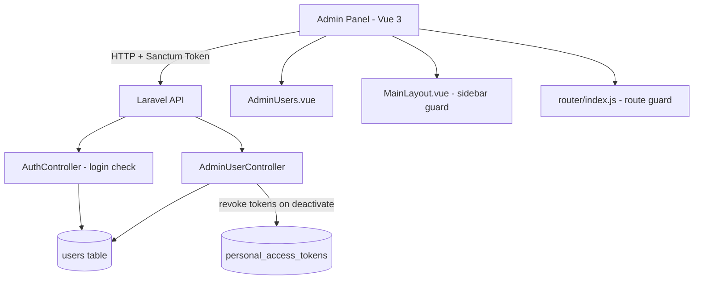

# Design Document: Admin User Management

## Overview

This feature adds an Admin User Management module to the WelcomeManado admin panel. The super admin (`admin@welcomemanado.com`) can list, create, edit, and toggle the active status of other admin accounts. A new `is_active` boolean column is added to the `users` table. Inactive accounts are blocked at login. The frontend provides a dedicated `/admin-users` page with a table and modals, accessible only to the super admin.

The stack is:
- **Backend**: Laravel 11 + Sanctum (at `api_wm/`)
- **Frontend**: Vue 3 + Pinia + Vue Router (at `admin_wm/`)

---

## Architecture



**Request flow for toggle-status (deactivate):**
1. Super admin clicks toggle on an active user row
2. `AdminUsers.vue` calls `POST /admin/users/{id}/toggle-status`
3. `AdminUserController@toggleStatus` flips `is_active`, then calls `$user->tokens()->delete()` to revoke all Sanctum tokens (force logout)
4. Returns updated user data; frontend updates the row reactively

**Login check flow:**
1. `AuthController@login` fetches user by email
2. If `is_active === false` AND email is not `admin@welcomemanado.com`, returns 403 with `account_inactive` error
3. Otherwise proceeds to issue token

---

## Components and Interfaces

### Backend

#### Migration: `add_is_active_to_users_table`
- Adds `is_active` boolean, default `true`, to `users` table

#### Middleware: `IsSuperAdmin`
- Checks `$request->user()->email === 'admin@welcomemanado.com'`
- Returns 403 if not super admin
- Applied to all `AdminUserController` routes

#### `AdminUserController`
| Method | Route | Description |
|---|---|---|
| `index` | `GET /admin/users` | List all users |
| `store` | `POST /admin/users` | Create new admin |
| `update` | `PUT /admin/users/{id}` | Edit name/email/password |
| `toggleStatus` | `POST /admin/users/{id}/toggle-status` | Flip is_active, revoke tokens if deactivating |

#### `AuthController@login` (modified)
- After credential check, verify `is_active` (with super admin bypass)

#### `User` model (modified)
- Add `is_active` to `$fillable`
- Add `is_active` cast to `boolean`

### Frontend

#### `AdminUsers.vue` (`admin_wm/src/views/users/AdminUsers.vue`)
- Table of all admin accounts
- "Tambah Admin" button → create modal
- Edit icon per row → edit modal (pre-filled)
- Toggle switch per row (hidden for super admin row)
- Inline validation error display

#### `MainLayout.vue` (modified)
- Add `admin-users` nav item to `navItems`
- Filter it in `filteredNavItems` to show only when `authStore.user?.email === 'admin@welcomemanado.com'`

#### `router/index.js` (modified)
- Add route `{ path: 'admin-users', name: 'admin-users', component: AdminUsers, meta: { requiresSuperAdmin: true } }`
- Extend `beforeEach` guard: if `to.meta.requiresSuperAdmin` and user is not super admin, redirect to dashboard

---

## Data Models

### `users` table (after migration)

| Column | Type | Notes |
|---|---|---|
| `id` | bigint PK | |
| `name` | string | |
| `email` | string unique | |
| `password` | string | bcrypt hashed |
| `is_active` | boolean | default `true` |
| `email_verified_at` | timestamp nullable | |
| `remember_token` | string nullable | |
| `created_at` | timestamp | |
| `updated_at` | timestamp | |

### API Response Shape — User Object

```json
{
  "id": 1,
  "name": "John Doe",
  "email": "john@example.com",
  "is_active": true,
  "created_at": "2026-01-01T00:00:00.000000Z"
}
```

### `AdminUserController` — Validation Rules

**store:**
```
name: required|string|max:255
email: required|email|unique:users,email
password: required|string|min:8
```

**update:**
```
name: sometimes|string|max:255
email: sometimes|email|unique:users,email,{id}
password: nullable|string|min:8
```

---

## Correctness Properties

*A property is a characteristic or behavior that should hold true across all valid executions of a system — essentially, a formal statement about what the system should do. Properties serve as the bridge between human-readable specifications and machine-verifiable correctness guarantees.*

### Property 1: Inactive users cannot log in

*For any* user whose `is_active` is `false` and whose email is not `admin@welcomemanado.com`, a login attempt with correct credentials SHALL be rejected with a non-200 response.

**Validates: Requirements 1.2**

---

### Property 2: New users are always created active

*For any* valid (name, email, password) tuple submitted by the super admin, the created user record SHALL have `is_active = true` and the response status SHALL be 201.

**Validates: Requirements 3.1**

---

### Property 3: Duplicate email is always rejected

*For any* email that already exists in the `users` table, a create or update request using that same email for a different user SHALL return 422 with a validation error on the `email` field.

**Validates: Requirements 3.2, 4.4**

---

### Property 4: Short passwords are always rejected

*For any* password string with length less than 8 characters, a create or update request SHALL return 422 with a validation error on the `password` field.

**Validates: Requirements 3.3**

---

### Property 5: Non-super-admin users are always forbidden from management endpoints

*For any* authenticated user whose email is not `admin@welcomemanado.com`, requests to any of the `GET /admin/users`, `POST /admin/users`, `PUT /admin/users/{id}`, or `POST /admin/users/{id}/toggle-status` endpoints SHALL return 403.

**Validates: Requirements 2.2, 3.4, 4.5, 5.4**

---

### Property 6: Toggle-status is an involution (round-trip)

*For any* non-super-admin user, applying toggle-status twice SHALL return the user to their original `is_active` state.

**Validates: Requirements 5.1, 5.2**

---

### Property 7: Deactivation revokes all tokens

*For any* active user with one or more Sanctum tokens, when the super admin deactivates that user (toggle-status), all of that user's personal access tokens SHALL be deleted from the `personal_access_tokens` table.

**Validates: Requirements 5.1 (confirmed behavior: force logout on deactivation)**

---

### Property 8: User list always contains required fields

*For any* set of users in the database, the `GET /admin/users` response SHALL include `id`, `name`, `email`, `is_active`, and `created_at` for every user in the result.

**Validates: Requirements 2.1**

---

### Property 9: Edit modal is pre-filled with current user data

*For any* user in the admin list, clicking the edit action SHALL pre-fill the modal form with that user's current `name` and `email` values.

**Validates: Requirements 7.3**

---

### Property 10: Sidebar link visibility matches super admin status

*For any* authenticated user, the sidebar link to the Admin Management page SHALL be visible if and only if the user's email equals `admin@welcomemanado.com`.

**Validates: Requirements 8.1, 8.2**

---

### Property 11: Validation errors appear next to the correct fields

*For any* API validation error response containing field-level errors, the Admin Management page SHALL display each error message adjacent to its corresponding form field.

**Validates: Requirements 7.5**

---

## Error Handling

### Backend

| Scenario | HTTP Status | Response |
|---|---|---|
| Login with inactive account | 403 | `{ "message": "Akun Anda tidak aktif. Hubungi super admin." }` |
| Unauthenticated request to protected route | 401 | Sanctum default |
| Non-super-admin on management endpoint | 403 | `{ "message": "Akses ditolak." }` |
| Attempt to deactivate/delete super admin | 403 | `{ "message": "Akun super admin tidak dapat diubah." }` |
| Duplicate email | 422 | `{ "errors": { "email": ["..."] } }` |
| Password too short | 422 | `{ "errors": { "password": ["..."] } }` |
| User not found | 404 | Laravel default |

### Frontend

- API errors from `axios` are caught in each action method
- Validation errors (422) are parsed from `error.response.data.errors` and bound to field-level `errors` reactive object
- Non-validation errors show a toast/alert with the `message` field
- Loading states (`isLoading`, `isSubmitting`) prevent double-submission

---

## Testing Strategy

### Unit / Example Tests (Backend — PHPUnit)

- Login rejected for inactive user (example)
- Super admin login succeeds even with `is_active = false` (example)
- Super admin toggle-status returns 403 (example)
- Super admin delete returns 403 (example)
- Unauthenticated list request returns 401 (example)
- Update without password leaves password unchanged (example)

### Property-Based Tests (Backend — PHPUnit with data providers / Pest `dataset`)

The project uses PHPUnit/Pest. Property-based tests are implemented using Pest's `dataset` with generated inputs (arrays of random values) to approximate property-based testing. Each test runs with a minimum of 20 varied inputs.

- **Property 1**: Generate N users with `is_active=false`, verify each login returns non-200
- **Property 2**: Generate N valid (name, email, password) tuples, verify each create returns 201 with `is_active=true`
- **Property 3**: Generate N existing emails, verify duplicate create/update returns 422 with email error
- **Property 4**: Generate N passwords of length 1–7, verify each returns 422 with password error
- **Property 5**: Generate N non-super-admin users, verify each management endpoint returns 403
- **Property 6**: Generate N non-super-admin users, toggle twice, verify `is_active` is restored
- **Property 7**: Generate N users with tokens, deactivate, verify token count is 0
- **Property 8**: Generate N users, call list, verify all required fields present in every record

### Frontend Tests (Vitest + Vue Test Utils)

- **Property 9**: Mount `AdminUsers.vue` with mocked user list, click edit for each user, verify modal fields match
- **Property 10**: Mount `MainLayout.vue` with various user emails, verify sidebar link presence matches super admin check
- **Property 11**: Simulate 422 response with various field errors, verify each error appears next to the correct input
- Route guard redirects non-super-admin to dashboard (example)
- Toggle button hidden for super admin row (example)
- Create modal opens with empty fields (example)
